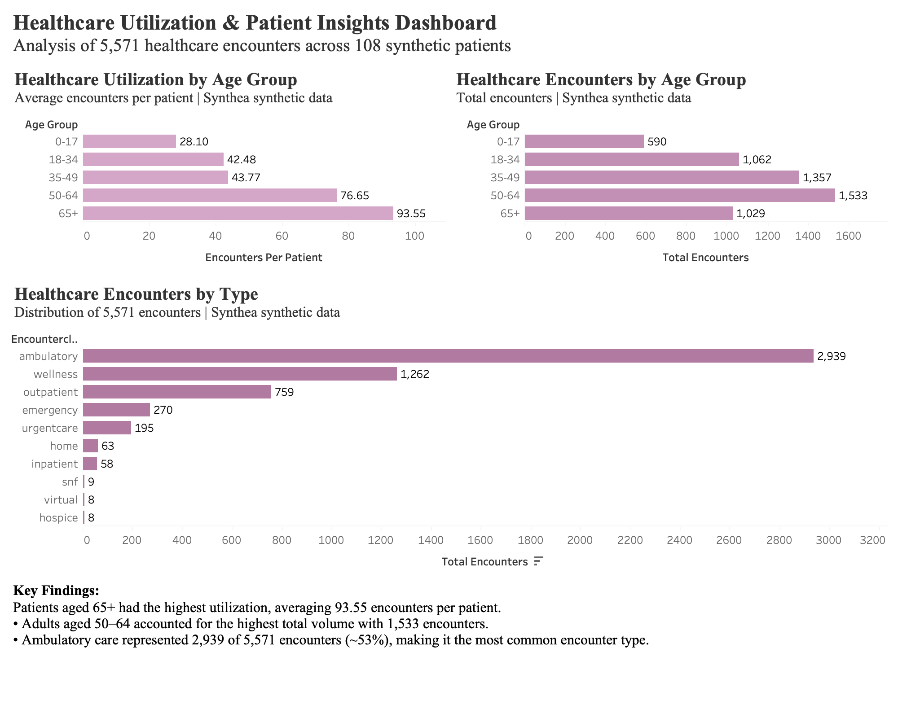

# Healthcare Utilization Analysis

## Project Overview
This project analyzes healthcare utilization patterns using synthetic patient data generated by Synthea. The goal was to explore how healthcare utilization varies across age groups and encounter types while practicing a healthcare analytics workflow from database querying to data visualization.

Patient and encounter data were analyzed in PostgreSQL using SQL, then visualized in Tableau to create an interactive healthcare utilization dashboard.

## Tools & Technologies
- PostgreSQL
- pgAdmin 4
- SQL
- Tableau
- Synthea Synthetic Patient Data

## Dataset
The project uses synthetic healthcare data from Synthea, an open-source synthetic patient generator. The dataset contains simulated patient demographics, clinical conditions, medications, and healthcare encounters.

For this analysis:
- 108 synthetic patients were analyzed
- 5,571 healthcare encounters were evaluated
- Encounter utilization was compared across age groups and encounter types

Because the dataset is synthetic, the findings are intended to demonstrate analytical methods and should not be interpreted as conclusions about real patient populations.

## Analysis

The analysis explored several healthcare utilization questions, including:

- Which age groups have the highest healthcare utilization?
- Which age groups account for the greatest overall encounter volume?
- What types of healthcare encounters occur most frequently?
- Which patients have the highest number of encounters?
- Which clinical conditions appear most frequently in the synthetic population?

SQL techniques used include:
- JOINs
- GROUP BY and aggregate functions
- COUNT and COUNT DISTINCT
- CASE statements
- Subqueries
- Common Table Expressions (CTEs)
- Window functions

## Key Findings

- Patients aged **65+ had the highest utilization**, averaging **93.55 encounters per patient**.
- Adults aged **50–64 generated the highest total encounter volume**, with **1,533 encounters**.
- **Ambulatory care represented 2,939 of 5,571 encounters (~53%)**, making it the most common encounter type.
- Healthcare utilization per patient generally increased with age within this synthetic cohort.

## Tableau Dashboard
The Tableau dashboard compares healthcare utilization across age groups and encounter types.
 
The dashboard includes:
- Average encounters per patient by age group
- Total encounters by age group
- Healthcare encounter distribution by encounter type

## Project Workflow

1. Imported Synthea healthcare data into PostgreSQL.
2. Created and queried patient, encounter, condition, and medication tables.
3. Used SQL to clean, aggregate, and analyze healthcare utilization data.
4. Exported analysis results as CSV files.
5. Built visualizations and an interactive dashboard in Tableau.
6. Summarized key healthcare utilization findings.

## Repository Contents

- `healthcare-analytics.sql` — SQL queries used for healthcare analysis
- `Healthcare_Utilization_Analysis.twbx` — Tableau packaged workbook
- `utilization_by_age.csv` — Age-group utilization results
- `encounter_types.csv` — Encounter-type distribution results

## Skills Demonstrated

SQL | PostgreSQL | Healthcare Data Analysis | Data Visualization | Tableau | Exploratory Data Analysis | Healthcare Informatics
